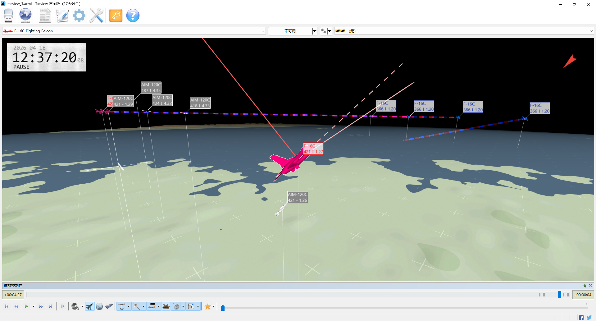

# BVRSim (天穹·空战演武) —— 高保真蜂群无人机超视距空战仿真平台

[](https://www.python.org/)
[](http://jsbsim.sourceforge.net/)
[](LICENSE)

## ✈️ 项目简介

**BVRSim (天穹·空战演武)** 是一个基于高保真飞行动力学模型的开源超视距空战仿真平台。
它使用 [JSBSim](http://jsbsim.sourceforge.net/) 作为核心物理引擎，集成 [Tacview](https://www.tacview.net/) 兼容的 ACMI 可视化日志，真实再现了现代空战中的飞行器运动、导弹制导、雷达探测与多机协同对抗过程。

本平台最初源于 **第十九届“挑战杯”全国大学生课外学术科技作品竞赛“揭榜挂帅”擂台赛** ——中国航空工业集团沈阳飞机设计研究所《复杂任务下无人机智能协同对抗算法》赛题，作者团队凭借稳定、高效的算法代码，和严谨、规范的设计文档，荣获该赛题 **一等奖**。赛后，作者基于公开资料与开源库独立重构了全部仿真代码，**不包含任何赛事涉密代码或内部数据**，并将其打造为一个开放、可扩展的蜂群无人机对抗仿真框架。

## 🔥 核心特点

- **高保真飞行动力学**

  采用 JSBSim 六自由度动力学模型，F-16 战斗机与 AIM-120C-5 导弹均经过严格参数校准，真实反映气动特性、推力曲线、质量变化与自动驾驶仪响应。

- **真实的导弹建模**

  AIM-120C-5 模型包含：
  - 基于公开资料的 51kg 推进剂、265s 比冲、7.75s 燃烧时间
  - 校准后的阻力系数与升力系数（消除 JSBSim 重复乘参考面积的常见错误）
  - 三回路自动驾驶仪（过载控制 + 角速率阻尼），支持 40G 极限机动
  - 中制导：零控脱靶量（ZEM）最优能量管理
  - 末制导：扩展比例导引（APN）对抗目标机动

- **灵活的红蓝对抗框架**

  用户只需继承 `bvrsim` 类并实现 `redstrategy` 、 `bluestrategy` 策略函数，即可自定义对抗逻辑。战场范围、威胁区、初始兵力均可配置。

- **Tacview 原生可视化**

  仿真过程自动生成 `.acmi` 文件，可直接拖入 Tacview 软件进行 3D 回放分析，支持显示雷达锁定、导弹轨迹、命中事件。

  

- **适于学术研究与 AI 训练**

  标准化的 `DroneInfo` 、 `SendData` 接口，便于与强化学习环境对接；

  已内置卡尔曼滤波目标状态估计、雷达探测模型、噪声干扰，可用于多智能体协同算法验证。

- **零额外依赖安装**

  Python 3.8+

  导入该库时，`__init__.py` 会自动检测并安装 `jsbsim`（其依赖 `numpy` 会一并自动安装），无需手动配置复杂环境。

  若需使用 Tacview 可视化，请从 [Tacview 最新版下载](https://www.tacview.net/download/latest/en/) 下载并安装 Tacview 软件（免费版即可）。

## 📦 环境安装

```bash
git clone https://github.com/numinous-dew/BVRSim.git
cd BVRSim
```
## 🚀 快速开始

### 运行最简示例
```python
from bvrsim import bvrsim

if __name__ == "__main__":  # 多进程必须
    bvrsim().main()
```
运行后，当前目录下会生成 tacview_`*`.acmi 文件，用 Tacview 打开即可观看空战过程。

### 自定义战场、初始兵力、策略
```python
from bvrsim import bvrsim, DroneInfo, SendData
import numpy as np

class MyBattleSim(bvrsim):
    def redstrategy(self, info: DroneInfo, step_num: int) -> SendData:
        """红方策略（需返回SendData指令）"""
        cmd = SendData()
        cmd.CmdSpd = 1.5
        cmd.CmdAlt = 12000
        cmd.CmdHeadingDeg = 180

        # 示例：每200步锁定敌机，再过100步发射导弹
        if step_num % 200 == 0:
            cmd.engage = -1                     # 火控锁定
        # 发射导弹
        elif step_num % 200 == 100 and 10 <= np.rad2deg(info.Pitch):  # 保证发射仰角
            cmd.engage = 1
        cmd.EnemyID = 3                     # 攻击/锁定ID=3的敌机
        return cmd

    def bluestrategy(self, info: DroneInfo, step_num: int) -> SendData:
        """蓝方策略（需返回SendData指令）"""
        cmd = SendData()
        cmd.CmdSpd = 1.2
        cmd.CmdAlt = 10000
        cmd.CmdHeadingDeg = 0

        if step_num % 150 == 0:
            cmd.engage = -1
        elif step_num % 150 == 75 and 10 <= np.rad2deg(info.Pitch):
            cmd.engage = 1
        cmd.EnemyID = 1
        return cmd

# 覆盖默认的初始兵力配置
# 自定义战场范围（纬度、经度、高度）
field = ((23.0, 26.0), (118.0, 120.0), (2000, 15000))

# 自定义威胁区（红方飞机额外禁区）
threat = ((24.5, 119.0, 0, 50000),)

sim = MyBattleSim(field=field, threat=threat)

# 自定义红蓝方初始参数（纬度、经度、高度、航向、马赫、导弹数、燃油）
sim.red=[
    dict(lat=25.8, lon=118.2, alt=10000, head=180, mach=0.8, num=4, fuel=5000),
    dict(lat=25.8, lon=118.4, alt=10000, head=180, mach=0.8, num=4, fuel=5000),
]
sim.blue=[
    dict(lat=23.2, lon=118.2, alt=10000, head=0, mach=0.8, num=6, fuel=5000),
    dict(lat=23.2, lon=118.4, alt=10000, head=0, mach=0.8, num=6, fuel=5000),
]
if __name__ == "__main__":
    sim.main(time=5)  # 仿真 5 分钟（游戏内时间）
```
## 🧠 核心接口说明

### DroneInfo（本机精确状态）
仿真每步会将本机状态打包为 `DroneInfo` 对象传递给策略函数。
```python
class DroneInfo:
    DroneID: int          # 本机ID
    Latitude: float       # 纬度 (rad)
    Longitude: float      # 经度 (rad)
    Altitude: float       # 高度 (m)
    Yaw: float            # 航向角 (rad)
    Pitch: float          # 俯仰角 (rad)
    Roll: float           # 滚转角 (rad)
    V_N, V_E, V_D: float  # NED速度分量 (m/s)
    A_N, A_E, A_D: float  # NED加速度分量 (m/s²)
    Mach_M: float         # 马赫数
    fuel: float           # 剩余燃油 (lbs)
    AlarmList: list       # 告警列表 [(辐射源ID, 相对方位角, 类型), ...]
    FoundEnemyList: list  # 发现敌机列表 (EnemyInfo对象)
    strike: list          # 本机导弹已击中的目标ID列表（包含敌机、友机或导弹，体现全体友伤设计）
    MissileNowNum: int    # 剩余导弹数量
```
### EnemyInfo（敌机带噪信息）
```python
class EnemyInfo:
    EnemyID: int
    isNTS: bool             # 是否已被本机火控锁定
    TargetDis: float        # 距离 (m)
    DisRate: float          # 径向相对速度 (m/s)
    TargetYaw: float        # 水平视线角 (rad)
    TargetPitch: float      # 垂直视线角 (rad)
    vNED: np.ndarray        # NED速度向量 (带噪声)
    TargetMach_M: float     # 估计马赫数
    MissilePowerfulDis: float  # 不可逃逸区距离 (动态计算)
    MissileMaxDis: float       # 最大射程 (动态计算)
```
### SendData（控制指令）
策略函数需返回 `SendData` 对象。
```python
class SendData:
    CmdSpd: float          # 期望马赫数
    CmdAlt: float          # 期望高度 (m)
    CmdHeadingDeg: float   # 绝对方位角 (deg)
    CmdPitchDeg: float     # 最大允许俯仰角 (deg)，可限制无人机颠簸，或解锁高过载机动
    CmdPhi: float          # 最大允许滚转角 (deg)，同上
    TurnDirection: int     # 0=就近转, 1=右转, -1=左转
    ThrustLimit: float     # 推力限制 (kN)，默认129
    engage: int            # -1=火控锁定, 1=发射导弹 (仅在值变化时触发)
    EnemyID: int           # 目标敌机ID
```
## 📁 文件结构
```
BVRSim/
├── __init__.py          # 包初始化，自动安装jsbsim
├── simulate.py          # 主仿真类 bvrsim，战场网格管理
├── drone.py             # F-16无人机模型、PID控制、导弹管理
├── missile.py           # AIM-120C导弹模型、制导律、卡尔曼滤波
├── tacview.py           # Tacview日志记录器
├── utils.py             # PID控制器、坐标转换、噪声生成等工具
└── aim120c.xml          # AIM-120C-5 高保真JSBSim气动配置文件
```
## 🛩️ 飞行器模型真实性设计

本平台在 Python 代码层面严格遵循现代空战仿真对物理真实性的要求，所有模型均依据公开文献与飞行动力学原理实现，确保仿真结果在工程上可信。

### F-16 战斗机模型 (drone.py)

| 设计要素 | 实现方式 | 真实性体现 |
|---------|---------|-----------|
| **飞行动力学核心** | 继承自 `model` 基类，底层调用 JSBSim 的 F-16 标准气动数据库 | 调用 JSBSim 内置的六自由度非线性运动方程求解器，气动系数由官方 F-16 模型查表提供，与真实 F-16 飞行包线高度吻合 |
| **级联 PID 控制器** | 外环：高度→俯仰角（`alt2pitch` PID）<br>内环：俯仰角→升降舵（`pitch2ele` PID）<br>滚转角→副翼（`roll2ail` PID）<br>马赫数→油门（`mach2thr` PID） | 采用三回路级联控制架构，符合现代战斗机飞行控制系统的分层设计；增益参数经过整定，响应平滑且无超调 |
| **控制限幅与保护** | 俯仰角、滚转角限幅（可解锁至 ±90°）、油门限幅 0.1~1.0 | 模拟真实飞控的包线保护逻辑，防止指令超出飞行器物理极限；也允许收紧限制保证平稳飞行 |
| **雷达与探测模型** | `radarR` 探测距离（蓝方优势 ×4/3）<br>`radarAngle` 探测半角 | 雷达探测受距离与视场角约束，目标信息引入测量噪声（距离、速度标准差正比于距离），真实反映机载雷达的有限感知能力 |
| **目标状态噪声** | `utils.sigma()` 生成随距离变化的噪声标准差 | 雷达测量误差随距离增大而增加，符合雷达方程的基本规律 |

### AIM-120C-5 导弹模型 (missile.py)

| 设计要素 | 实现方式 | 真实性体现 |
|---------|---------|-----------|
| **高保真气动引擎** | 加载自研 `aim120c.xml` JSBSim 配置文件，包含完整气动力/力矩系数、推力曲线、质量特性 | 气动系数经过校准，均以无量纲形式定义，由 JSBSim 自动乘以动压与参考面积，避免了社区模型中常见的双重面积乘积错误；阻力跨音速峰值、升力斜率、静不稳定布局（Cmα=+0.25）均与公开资料吻合 |
| **固体火箭发动机** | 推力表基于推进剂质量 51 kg、比冲 265 s、燃烧时间 7.75 s 推导 | 推力曲线呈现平稳燃烧段与末端衰减段，真实模拟 HTPB 推进剂特性 |
| **三回路自动驾驶仪** | 外回路：过载指令（Nz、Ny）→ 角速率指令<br>内回路：角速率指令 → 舵面偏转 | PID 增益基于动压调度（`qbar-psf`），缩小为原值 1/10 以匹配校准后的气动效率，实现全包线稳定控制 |
| **中制导：零控脱靶量（ZEM）** | N * min(1, 0.8+0.02*tgo) * (vn/tgo + an/2) | 基于最优控制理论，以最小能量消耗预测拦截点，符合中制导段能量管理原则 |
| **末制导：扩展比例导引（APN）** | N * Vc * cross(los, vel)/dis + N/2 * an * min(1, tgo/2) | 在经典比例导引基础上增加目标机动加速度补偿项，能有效对抗高机动目标 |
| **目标状态估计（卡尔曼滤波）** | `Kalman` 类实现 9 状态（位置、速度、加速度）Singer 模型 | 对雷达带噪测量进行最优估计，提供平滑的目标状态用于制导律计算；当目标丢失时自动增大过程噪声，模拟滤波发散 |
| **主动雷达导引头** | `radarR = 5e3`，`radarAngle = 20°`，进入末制导后自主搜索 | 模拟“发射后不管”能力，末段自主截获目标 |

### 坐标系与运动学工具 (utils.py)

| 函数/类 | 功能 | 真实性设计 |
|--------|------|-----------|
| `geo2NED` / `NED2geo` | 地理坐标 ↔ NED 直角坐标 | 将地球视为规则球体计算，本项目的距离均可忽略其影响，但考虑纬度变化对经度方向距离的影响 |
| `los2NED` / `NED2los` | 视线角 ↔ NED 向量 | 支持本体姿态补偿，用于雷达测角与导引头建模 |
| `pid` 类 | 离散 PID 控制器 | 包含积分抗饱和逻辑（条件积分），避免控制量超限后积分器发散 |
| 噪声生成 | `sigma()` 与 `np.random.normal` | 为雷达测量添加符合真实传感器特性的高斯噪声 |

### 绝对状态扩展卡尔曼滤波器

`missile.py` 中的 `Kalman` 类实现了一种绝对状态扩展卡尔曼滤波器，用于在 NED 惯性系下实时估计目标的位置、速度和加速度。该滤波器是导弹中制导、末制导阶段获取平滑目标状态的核心组件，其设计在传统 Singer 模型基础上做了若干创新性改进，有效提升了目标机动状态估计的鲁棒性与精度。

#### 绝对状态估计

**创新动机**：传统机载雷达滤波常采用 **相对坐标系**（如视线系或载机本体系），其状态量随载机机动而剧烈变化，且相对加速度难以计算和预测，非线性强且易发散。本滤波器直接在 **NED 绝对地理坐标系** 下估计目标的绝对位置、绝对速度和绝对加速度。

**优点**：
- 状态转移矩阵仅与目标自身运动模型有关，与载机/导弹机动解耦，线性度更好。
- 导弹在快速转弯时，滤波器的预测步不受自身姿态/速度变化影响，稳定性显著提高。
- 可无缝支持数据链共享目标信息（多个观测源对同一绝对状态进行融合）。

#### 基于矩阵指数的离散化 Singer 模型

**背景**：Singer 模型将目标绝对加速度建模为一阶零均值马尔可夫过程，机动频率 `α` 表征目标机动时间常数的倒数。连续状态方程为：
$$
Ẋ = A·X + w
$$
其中 X = [x, ẋ, ẍ]ᵀ，A 为 3×3 状态矩阵，w 为连续白噪声。

**传统做法**：对 Singer 模型采用一阶泰勒近似离散化（如欧拉法），当 `dt` 较大时（本仿真步长 0.01 s 满足条件，但为通用性考虑）会引入显著离散化误差。

**创新实现**：
- 使用 **9 阶 Padé 近似矩阵指数** (`expm` 函数) 计算精确的离散状态转移矩阵 $Φ = e^{A·dt}$，该方法在数值稳定性与计算精度上优于传统泰勒展开。
- 对过程噪声协方差矩阵 **Q** 采用相同精度的矩阵指数积分公式：
$$
Q = ∫₀ᵈᵗ Φ(τ) Q_cont Φᵀ(τ) dτ
$$
通过构造增广矩阵并计算其矩阵指数，一步得到离散化后的 **Φ** 和 **Q**，避免了近似带来的长期仿真累积误差。

#### 自适应机动频率调节

**创新点**：滤波器根据目标是否被雷达截获，动态调整 Singer 模型的机动频率 α。
- 目标正常跟踪时：α = 0.1，对应较长的机动时间常数（约 10 s），适用于目标平稳飞行阶段。
- 目标丢失（雷达未更新）时：α 自动增大至 0.1 + 1.0 = 1.1，即假设目标可能进行转弯或加减速，丢失前一刻的加速度信息变得不太可信，需要快速衰减。这一设计有效抑制了因长时间无观测导致的协方差过度收敛问题，使滤波器在目标重新出现时能快速重新收敛。

#### Joseph 形式协方差更新与 PSD 强制
**Joseph 形式更新**：采用 $P = (I-KH)P(I-KH)^T + KRK^T$，而非简化式 $P = (I-KH)P$。前者在数值上具有更好的对称性和正定性保持能力，能有效抵抗计算机舍入误差引起的滤波器发散。

**PSD 强制**：每次预测、更新后调用 psd(P)，通过特征分解，将负特征值改为微小正数并重构矩阵，确保协方差矩阵始终半正定，这是长航时仿真中滤波器稳定运行的关键保障。

#### 对制导性能的提升

采用绝对状态 EKF 后，制导律（ZEM、APN）直接使用滤波器输出的平滑绝对加速度 aNED，并转换为法向加速度进行目标机动补偿。相较于直接使用含噪声的雷达测量值或简单 α-β 滤波，本滤波器能提供：
- 更准确的剩余飞行时间 tgo 估计（基于平滑速度）
- 更精准的目标机动加速度 an，使 APN 的补偿项更有效
- 更高的命中概率，尤其在目标做大过载规避机动时

**注**：碰撞检测采用“全体友伤”原则——任何实体（含友军、导弹、载机）之间距离小于 5 米即判定为同归于尽，真实模拟空战中的意外相撞与误击风险。

以上设计确保本平台在算法验证、战术推演与强化学习训练中能够输出具备物理可信度的仿真结果。

## 🎯 应用场景
- **学术研究**：多无人机协同任务分配、编队控制、智能博弈算法验证
- **毕业设计**：空战仿真环境、导弹制导律对比、飞行控制律设计
- **强化学习**：自定义 Gym-like 接口，可快速封装为 RL 环境
- **教学演示**：直观展示超视距空战全过程、雷达原理、导弹导引律
- **二次开发**：可替换飞机/导弹模型（修改 JSBSim 配置文件或 Python 模型类）

## ⚖️ 开源协议

本项目采用 **MIT License**。
你可以自由使用、修改、分发代码，但需保留原作者版权声明。

## 🙏 致谢
- JSBSim 开发团队提供的强大飞行动力学引擎
- 第十九届“挑战杯”竞赛组委会与中国航空工业集团沈阳飞机设计研究所提供的赛题启发
- 社区公开的 AIM-120C 性能评估报告与 DCS CFD 研究成果

## 📬 联系方式
如有问题或合作意向，欢迎通过 GitHub Issue 或邮件联系作者。

## 免责声明
本项目仅为学术研究与教育目的而开发，不包含任何国家秘密或受控数据。所有飞行器参数均来源于公开文献与开源社区推导，与真实装备可能存在差异，用户可自行调整。
